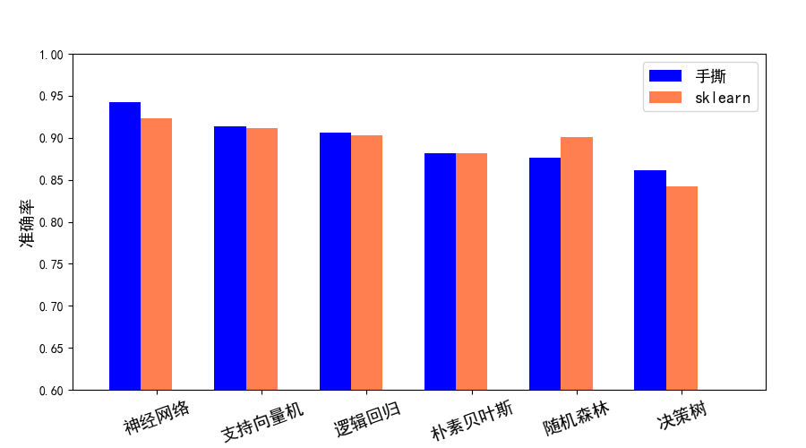
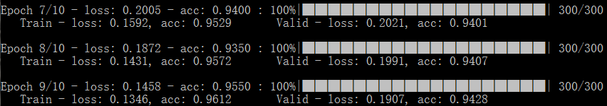

## 手撕机器学习

用腻了开源框架，尝试下手撕机器学习模型？习惯了调包与调参容易被开源驾驭，写这个手撕机器学习系列，旨在不使用任何开源框架的情况下手推实现各种模型，同时保证高性能。

已实现的模型全部使用minist数据集测试验证，并与sklearn做了对比：

特殊说明：

* 所有模型训练之前都对minist数据做了LDA压缩，为了保证特征分解过程非奇异，对数据加入了少量白噪声，所以每次训练结果都有微小差异；
* 每种模型适用不同的数据维度，例如神经网络、逻辑回归适用于高维数据，而朴素贝叶斯和决策树适用于低维数据，所以每种模型使用的特征维度并不一定一样；
* 同种模型在手撕实现和sklearn之间都使用相同的参数配置，只有优化过程的细节差异。

### Requirements
适用于python2.7与python3.6，依赖包：
- numpy，实现模型结构的主要库
- scipy，稀疏矩阵与部分高级线性代数运算库
- tqdm，神经网络训练进度条显示

### 推断模型

#### 神经网络
numpy手撕神经网络，二分类使用sigmoid作为输出激活函数，多分类使用softmax作为输出激活函数，为了方便手推梯度公式，隐藏层统一使用tanh激活，支持dropout，使用Adam优化器，可显示训练进度条。
Neural Network特性：
* 采用迭代的方式更新参数，复杂度随数据维度线性增加，所以可以适用于高维数据；
* 基于梯度更新的优化方式，所以对数值的尺度比较敏感，输入的规范化、参数的初始化、初始学习率的设置影响较大；
* 采用min_batch的方式迭代更新，平衡GD与SGD的优劣，dropout是一种成本很低的高效正则手段，每轮迭代随机更新部分参数。

运行示例：

	python neural_network.py --batch 200 --epochs 10 --dropout 0.5
	

#### 逻辑回归
逻辑回归相当于没有隐藏层的神经网络，所以可以继承神经网络的大部分特性，同样使用Adam优化参数，支持dropout。

运行示例：

	python logistic_regression.py --epochs 50 --dropout 0.1

#### 朴素贝叶斯
实现高斯分布与多项分布两种类型，Naive Bayes实现过程较为明确，没有多少优化技巧而言，所以在性能上几乎与sklearn完全一致。
Naive Bayes特性：
* 严格的条件独立性假设，对于低维数据表现较好，对于高维数据这样的假设容易导致欠拟合与偏差；
* 实现过程中只需要存储标签先验概率分布与似然函数，如果采用密度函数表示似然函数（如高斯分布）则记录函数参数，如果采用离散化的分布律（多项分布）则记录p(x|y)矩阵。

运行示例：

	python naive_bayes.py --mode gaussian
	
#### 决策树
在连续型属性的离散化上做了优化，支持多级别量化，运用动态规划搜索属性最优量化划分，比传统决策树的二分法泛化能力略高一点，决策树的构建过程基本相同。
Decision Tree特性：
* 学习的是一种数据的最优划分方式，因为是基于分支的方法，所以对数值的尺度、归一化不敏感；
* 由于树的结构特性，决策树可以方便处理缺省值和异常值（统一表示为缺省）；
* 与朴素贝叶斯相反，决策树过度考虑特征的联合（不考虑剪枝的话），所以对于高维数据容易导致数据的稀疏性和过拟合；

运行示例：

	python decision_tree.py --max_depth 9
	
#### 随机森林
基于决策树实现随机森林，使用多进程并行构建森林，但是结果相比单颗决策树泛化能力没有较大提升，这也是唯一一个比sklearn差的模型，具体原因目前未知。
Random Forest特性：
* 集成学习的一种，以决策树为基模型，运用行采样和列采样方法将数据集的子集喂给子模型；
* ensamble的偏差和方差与每个子模型的偏差、方差以及模型之间的相关性有关，所以要保证行采样和列采样的随机性；
* 由于每颗树是独立的，所以易于并行实现。

运行示例：

	python random_forest.py --max_depth 9 --n_estimators 30 --workers 4
	
#### 支持向量机
实现最小二乘支持向量机（LSSVM），LSSVM的空间复杂度太高，所以对训练集进行了重采样，并且内置均衡采样进一步降低维度，同时可以平衡正负例（对于多分类的话会将每个类别单独看做一个二分类，将其它类别统一表示成负例，所以负例的比例会很高）。
LSSVM特性：
* 将不等式约束转化为等式约束，方便将问题转化为求解线性方程组，实现过程简单；
* 方程组规模太大，空间复杂度高，不适合大规模训练样本；
* SVM的决策函数相当于增强版的Knn，新样本对支持向量的核映射相当于相似度权重，再结合支持向量的alpha权重对标签进行加权表决。

运行示例：

	python svm.py --kernel rbf --C 0.1
	
#### 未完待续。。。